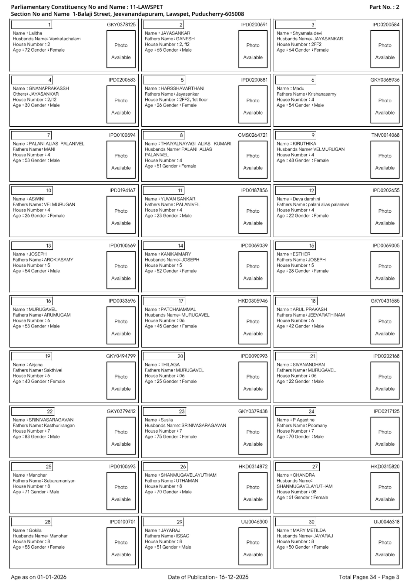

#  Electoral Roll OCR

> An end-to-end OCR pipeline to extract, digitize, and structure voter information from scanned Indian electoral roll PDFs.


---

##  Overview

Electoral rolls in India are distributed as scanned PDF documents, making bulk data extraction a slow and manual process. This project automates that entirely — it ingests a raw electoral roll PDF, detects individual voter card regions on each page using computer vision, runs OCR over each card, and exports all structured voter records into a clean Excel workbook.

The pipeline is designed to closely mirror an exploratory notebook workflow while being modular, maintainable, and easy to run from the command line.

---

##  Expected Input Format

The pipeline accepts scanned Indian electoral roll PDFs (or pre-converted page images). Each page should follow the standard Election Commission of India layout:

- **Page header** — Constituency name/number, section name, and part number printed at the top.
- **Voter card grid** — Each page contains a 3-column grid of individual voter cards.
- **Per-card layout** — Every voter card contains:

  | Field            | Example                             |
  | ---------------- | ----------------------------------- |
  | Serial Number    | `7` (top-left corner of the box)    |
  | EPIC Number      | `IPD0100594` (top-right of the box) |
  | Name             | `Name : PALANI ALIAS PALANIVEL`     |
  | Relative's Name  | `Fathers Name: MANI`                |
  | House Number     | `House Number : 4`                  |
  | Age & Gender     | `Age : 53 Gender : Male`            |
  | Photo Placeholder| A rectangular box labelled *Photo Available* |

**Sample page:**



> Pages that are cover pages or constituency headers (containing no voter records) can be skipped using the `--skip-front-pages` flag.

---

##  Features

- **PDF to image conversion** — Automatically converts electoral roll PDFs to page images using Poppler
- **Intelligent voter box detection** — Detects individual voter card bounding boxes per page (width > 400px, height > 120px) using OpenCV contour analysis
- **OCR with Tesseract** — Extracts raw text from each voter card crop using `--psm 6` (uniform block mode)
- **EPIC number extraction** — Parses EPIC numbers from header crops with built-in OCR correction (3 letters + 7 digits pattern), with fallback to the first OCR line
- **Structured field extraction** — Pulls the following fields from every voter record:
  - Serial Number
  - EPIC Number
  - Voter Name
  - Relative Name & Relation Type
  - House Number
  - Age
  - Gender
- **Excel export** — Outputs a formatted `.xlsx` workbook to `output/voter_output.xlsx`
- **Numeric page sorting** — Correctly sorts `page_*.jpg` files numerically, not lexicographically
- **Configurable front-page skipping** — Optionally skip cover/header pages that don't contain voter records
- **Auto-save during processing** — Saves progress after every N pages to guard against interruptions
- **Startup cleanup** — Automatically removes legacy output files from older versions on launch

---

##  Project Structure

```
electoral-roll-ocr/
│
├── main.py                    # Entry point — runs the full end-to-end extraction pipeline
│
├── pipeline/
│   ├── image_loader.py        # Loads page images; handles PDF-to-image conversion
│   ├── preprocessing.py       # Page thresholding and voter card box detection
│   ├── ocr_engine.py          # Tesseract OCR helpers and EPIC number extraction logic
│   ├── parser.py              # Parses raw OCR text into structured voter fields
│   └── exporter.py            # Writes the final formatted Excel workbook
│
├── frontend/                  # Web frontend for uploading PDFs and viewing results
│
├── api.py                     # REST API layer (connects frontend to the pipeline)
├── app.py                     # App server entry point
│
├── images/                    # Page images (auto-generated from PDF, or supplied manually)
├── output/                    # Output directory — voter_output.xlsx is saved here
│
├── sample_data.pdf            # Sample electoral roll PDF for testing
├── requirements.txt           # Python dependencies
└── package.json               # Frontend dependencies
```

---

##  Installation

### Prerequisites

Make sure the following are installed on your system before proceeding:

| Dependency    | Purpose                 | Install                                                                                                    |
| ------------- | ----------------------- | ---------------------------------------------------------------------------------------------------------- |
| Python 3.8+   | Core runtime            | [python.org](https://www.python.org/downloads/)                                                            |
| Tesseract OCR | Text recognition engine | [Installation guide](https://github.com/tesseract-ocr/tesseract#installing-tesseract)                      |
| Poppler       | PDF-to-image conversion | `apt install poppler-utils` / [Windows builds](https://github.com/oschwartz10612/poppler-windows/releases) |

### Clone & Install

```bash
git clone https://github.com/DeekshaR06/electoral-roll-ocr.git
cd electoral-roll-ocr
pip install -r requirements.txt
```

---

##  Usage

### Option 1 — Run with a PDF *(recommended)*

```bash
python main.py --pdf sample_data.pdf
```

This converts the PDF to page images, processes every page, and exports results to `output/voter_output.xlsx`.

### Option 2 — Run with pre-existing page images

If you have already converted the PDF to images (`page_001.jpg`, `page_002.jpg`, ...) placed in the `images/` directory:

```bash
python main.py
```

### Additional Options

```bash
# Skip the first 2 pages (e.g. cover page, constituency header)
python main.py --pdf your_roll.pdf --skip-front-pages 2

# Specify custom image and output directories
python main.py --pdf your_roll.pdf --images images --output output

# Auto-save progress after every page (useful for large PDFs)
python main.py --pdf your_roll.pdf --autosave-every-pages 1

# Use the bundled sample PDF if no images are found
python main.py --use-sample-pdf-if-empty
```

### Windows — Set Tesseract Path

If Tesseract is not on your system PATH, point to it manually before running:

```powershell
$env:TESSERACT_CMD = "C:\Program Files\Tesseract-OCR\tesseract.exe"
python main.py --pdf sample_data.pdf
```

---

##  Output

After a successful run, `output/voter_output.xlsx` will contain one row per voter with the following columns:

| Column          | Description                                 |
| --------------- | ------------------------------------------- |
| `Serial Number` | Voter's serial number on the roll           |
| `EPIC Number`   | Unique Elector's Photo Identity Card number |
| `Name`          | Voter's full name                           |
| `Relative Name` | Name of father / mother / spouse            |
| `Relation Type` | Relation (Father / Mother / Husband / Wife) |
| `House Number`  | Residential house number                    |
| `Age`           | Voter's age                                 |
| `Gender`        | Male / Female / Other                       |

---

## 🛠️ Tech Stack

| Library                     | Role                                       |
| --------------------------- | ------------------------------------------ |
| **OpenCV**                  | Page preprocessing and voter box detection |
| **Tesseract / pytesseract** | OCR text extraction                        |
| **pdf2image / Poppler**     | PDF to page image conversion               |
| **Pandas**                  | Data structuring and manipulation          |
| **openpyxl**                | Formatted Excel workbook export            |

---

##  Contributing

Contributions are welcome! To get started:

1. Fork the repository
2. Create a feature branch (`git checkout -b feature/your-feature`)
3. Commit your changes (`git commit -m 'Add your feature'`)
4. Push to the branch (`git push origin feature/your-feature`)
5. Open a Pull Request

Please open an issue first for significant changes or new features so we can discuss the approach.

---

##  License

This project is licensed under the MIT License. See the [LICENSE](LICENSE) file for details.

---

##  Authors

<table>
  <tr>
    <td align="center">
      <a href="https://github.com/DeekshaR06"><b>Deeksha R</b></a>
    </td>
    <td align="center">
      <a href="https://github.com/Samcode-16"><b>Samudyatha K Bhat</b></a>
    </td>
  </tr>
</table>